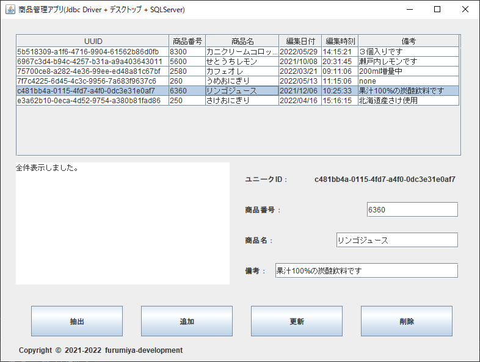

## :computer: デスクトップアプリ(Swing)でJDBC Driverを使いSQLServerとの読み書きサンプル  
___
## 開発環境  
```
統合開発環境：Eclipse 2022-09 R(4.25.0) Pleiades  
言語：Java 17  
デベロッパーSDK：Oracle JDK 17.0.5  
デスクトップ：Swing  
データベース：Microsoft SQLServer 2022 Express RTM  
-データベース管理ツール：Microsoft SQL Server Management Studio 18.12.1
データベース接続：Microsoft JDBC Driver 11.2.1 for SQL Server  
```

  

**テーブル作成**  
```
use [master]
create table [JdbcSample].[dbo].[shohins] (
	unique_id char(36) NOT NULL,        /*ユニークID*/
	shohin_code int NOT NULL,           /*商品番号*/
	shohin_name char(50),               /*商品名*/
	updated_on decimal(8,0) NOT NULL,   /*編集日付*/
	updated_at decimal(6,0) NOT NULL,   /*編集時刻*/
	remarks varchar(255),               /*備考*/
	primary key (unique_id))
```

___